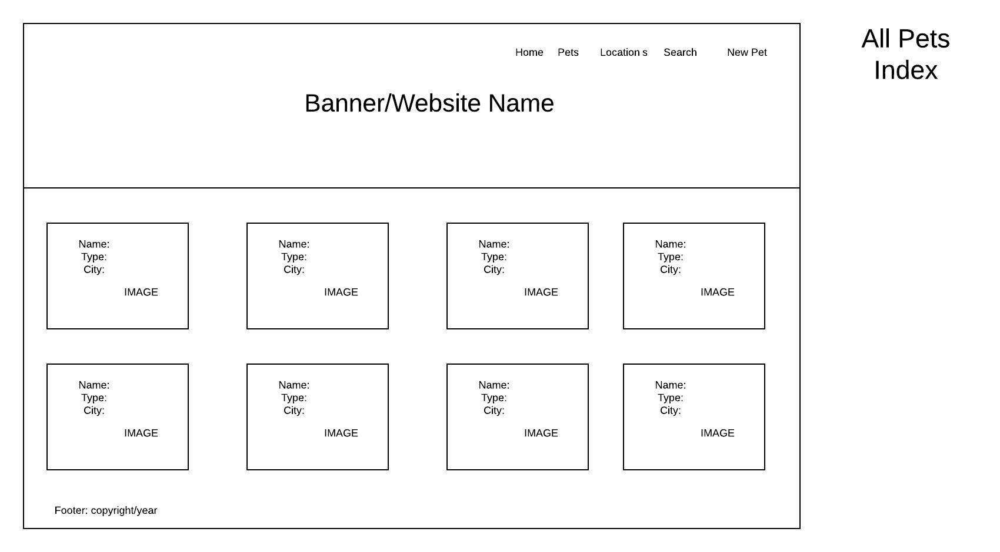
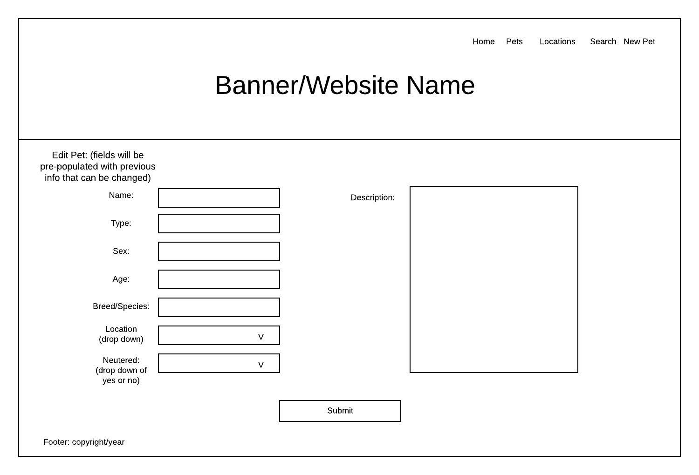
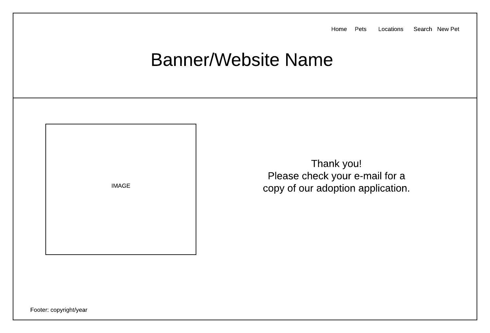
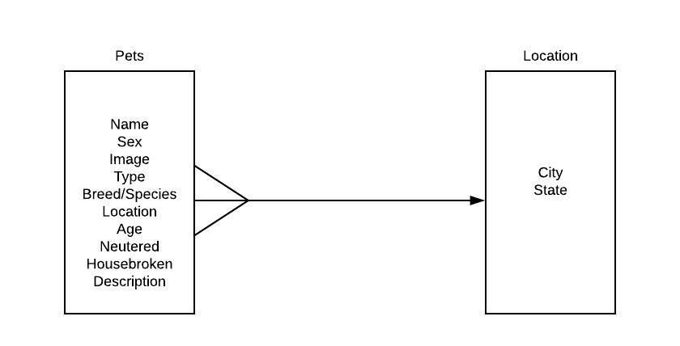

# pets4u

Pets4U is a non-profit pet-placement program specializing in the rehoming dogs, cats, and exotic pets throughout the mid-East coast. Our mission is to provide a network for those searching for the perfect "furever" family member! From fur to fins, we here at Pets4U believe every pet deserves a loving home. We provide services in Pennsylvania, Delaware, Maryland, Virginia, and North Carolina. 

## User Stories

User Story

This is a website for adopting pets.  The home page should have a banner and name of the company.  The banner and the name will be on all pages of the website. There will be a brief description of what the company is about.  Underneath that there should be buttons to take you different pages to search and add pets.  The buttons will be: all pets, pets by location, custom search, and add pet.

When you click on all pets you will be taken to the pets index page.  After the main page all other pages should contain a nav bar with the following links: home, pets, locations, search, and new pet. On this page there will be images of the individual pets. On the image will be the name of the pet and the location.  The user will choose a specific pet by clicking on the image.

This will take you to the show page.  On this page there will be the name of the pet as well as an image.  If there are multiple images they can be viewed as a carousel. Next to the image will be the other information, such as sex, animal type, breed/species. Neutered, location, age, and description. Next to that will be an adopt button.  Underneath the image there will be buttons to delete or edit the pet information.

If you click the adopt button the page will ask for the user to enter their name and email address. Once they have done that they will click a submit button and be taken to a new page where their submission will be acknowledged and they will be given information on the next step of their application process.

If they click the edit button they will be taken to a page with pre populated fields for all the properties of the pet and they will have the option of changing information.  Once done they will click submit and be taken back to the show page.

If they click delete the pet will be removed from the database and the user will be taken back to the pet index page.

From the home page or using the nav bar if the user clicks the locations link they will be taken to a page with lists of the different cities, separated by state,  where pets are located. If they click on a city they will be taken to an index page that will have pets that are located only in that city. By clicking on those pets they will be taken to the pet show page.

If the user clicks on new pet they can add a pet to the database.  They will be sent to a page that is similar to the edit page but without pre populated fields.  When they click submit they will be taken to the show page for that newly created pet.

If the user chooses the custom search option on the home page or the nav bar they will be taken to a page where they can choose specific criteria to limit their search.  Once they submit their search they will be taken to an index page with only animals that fit the specific criteria.

## Wireframes
### Home Page

### Pet Index

### Pet Show Page

### New Pet Page

### Edit Pet Page

### Adopt Page

### Confirm Page

### All Cities Search Page

## ERD

## Milestones
### Day 1 (7/9) Project Planning
### Day 2 (7/10) More planning, project approval, laid out boilerplate
### Weekend (7/11-7/12) Research and development, data population
### Day 3 (7/13) Set up models, controllers, views, basic structure completed
### Day 4 (7/14) Models connected together, third model for adoptions added, basic CSS added
### Day 5 (7/15) Nodemailer, image upload, authentication added, CSS refined, error handling
### Day 6 (7/16) CSS refinement continued, more error handling

## Interesting Code

### Post Route with image upload, authentication check, and checkbox value conditional

  router.post('/', (req, res) => {
     if (!req.session.currentUser) return res.redirect('/login');
    
     upload(req, res, (err) => {
         if (err) console.log(err);
       
        if (req.body.neutered === 'on') {
             req.body.neutered = true;
         } else {
             req.body.neutered = false;
         }
      
         db.Pet.create(req.body, (err, newPet) => {
             if (err)console.log(err);
           
             if (req.file) {
                 newPet.image = `/images/${req.file.filename}`;

             } else {                
                 newPet.image = 'https://i.ebayimg.com/images/g/nkQAAOSw84ZcTbvu/s-l300.png';
             }
             newPet.save((err, savedPet)=> {

                 res.redirect('/pets')
             })
         })
     })
 })

## Dependencies Installed

### bcryptjs
### dotenv
### ejs
### express
### express-session
### method-override
### mongoose
### multer
### nodemailer

## Technologies Utilized

### HTML
### CSS
### Javascript
### Node
### Express
### MongoDB

## Sources

### Nodemailer- Youtube tutorial by Esterling Accime https://www.youtube.com/watch?v=Va9UKGs1bwI

### Multer Image Upload- Multer Tutorial by Brad Traversy - https://www.youtube.com/watch?v=9Qzmri1WaaE

### Authentication- Kenny Bushman lecture 

